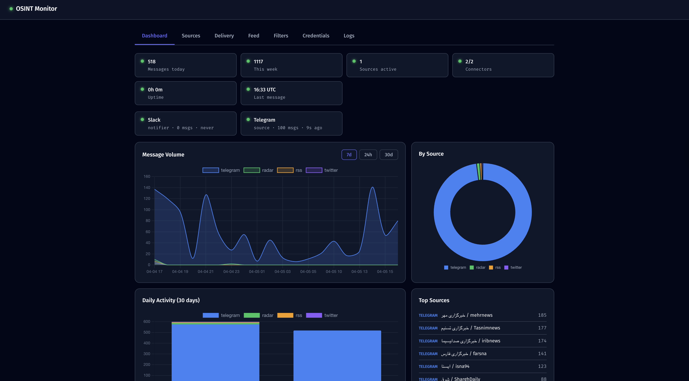

# OSINT Monitor

Self-hosted intelligence monitoring. Watch Telegram, Twitter/X, RSS feeds, and Cloudflare Radar — get real-time alerts on WhatsApp, Discord, Slack, Signal, Email, or any webhook.



## Use Cases

**Threat Intelligence / OSINT Teams** — Monitor Telegram channels used by threat actors, hacktivist groups, or regional news sources. Get keyword-filtered alerts delivered to your team's Slack or Discord. Export collected intelligence as CSV for reporting.

**Security Operations Center (SOC)** — Track infrastructure status feeds (AWS, Azure, GCP, Cloudflare) alongside Cloudflare Radar traffic anomalies. Get immediate alerts when outages or internet disruptions hit your regions of interest.

**Journalism & Research** — Follow X/Twitter accounts and Telegram channels for breaking developments. Auto-translate Arabic, Russian, Chinese, or any other language via LibreTranslate. Keyword filters ensure you only get alerted on what matters.

**Infrastructure Monitoring** — Subscribe to RSS/Atom status feeds from any provider. Filter by keywords (e.g., "us-east-1", "degraded"). Push alerts to an on-call Slack channel or PagerDuty via webhook.

**Personal Intelligence Feed** — Consolidate your information sources into a single dashboard with a searchable message cache, analytics, and CSV/JSON export. Run it on a Raspberry Pi, a Proxmox LXC, or a cloud VM.

## Quick Start

### Docker (recommended)

One command. Includes auto-translation (LibreTranslate) out of the box. WhatsApp bridge starts on-demand when you configure it.

**Linux:**
```bash
git clone https://github.com/tannertunstall/osint-monitor.git
cd osint-monitor
sudo bash setup.sh
```

**macOS (Intel + Apple Silicon):**
```bash
git clone https://github.com/tannertunstall/osint-monitor.git
cd osint-monitor
bash setup.sh
```

**Windows (PowerShell):**
```powershell
git clone https://github.com/tannertunstall/osint-monitor.git
cd osint-monitor
powershell -ExecutionPolicy Bypass -File setup.ps1
```

Open **http://localhost:8550** in your browser. Everything is configured from the dashboard — no config files to edit.

> On macOS/Windows, Docker Desktop must be running. The setup script installs it if needed — you may need to open Docker Desktop and re-run the script.

### pip install (no Docker)

Lightweight install without WhatsApp bridge or translation. Bring your own LibreTranslate endpoint if needed.

```bash
pip install .
osint-monitor
```

With email support: `pip install ".[email]"`

---

## Your First Monitor (5-minute walkthrough)

Once the dashboard is open at `:8550`, here's the fastest path to a working monitor:

### Step 1: Add a source

Go to the **Sources** tab. The easiest source is RSS — just check one of the preset boxes:

- **AWS Status** — monitors all AWS service health
- **Cloudflare Status** — monitors Cloudflare incidents
- **GitHub Status** — monitors GitHub outages

Or paste any RSS/Atom feed URL in the custom field.

### Step 2: Add a delivery method

Go to the **Delivery** tab. The easiest channel is Discord:

1. Toggle **Discord** on
2. Paste your webhook URL (see [Discord setup](#discord) below)
3. Click **Add**

### Step 3: Save & Restart

Click **Save & Restart** at the bottom. Confirm the dialog. The monitor restarts (~10-30 seconds), and you'll see a "Restarting..." overlay that auto-reconnects when it's back.

### Step 4: Watch it work

Go to the **Dashboard** tab. Within a couple of minutes you'll see:
- Message counts updating
- Charts populating
- Connector health indicators turning green

Check the **Feed** tab to browse collected messages. Check **Logs** if something isn't working.

---

## Setting Up Sources

### Telegram

Telegram requires API credentials and phone authentication. This is a one-time setup.

**Get API credentials:**
1. Go to [my.telegram.org](https://my.telegram.org) and log in with your phone number
2. Click **"API development tools"**
3. Create a new application (name and platform don't matter)
4. Copy your **API ID** (a number) and **API Hash** (a hex string)

**Configure in the dashboard:**
1. Go to **Credentials** tab
2. Enter your API ID and API Hash
3. In the **Account Authentication** section, enter your phone number (with country code, e.g., `+1234567890`)
4. Click **Send Code** — a verification code arrives in your Telegram app
5. Enter the code. If you have 2FA enabled, enter your password when prompted
6. Go to **Sources** tab, add channel usernames (e.g., `@channel_name`) or t.me links
7. Click **Save & Restart**

### X / Twitter

No API key required. OSINT Monitor uses Nitter RSS (a privacy-preserving Twitter frontend) to poll accounts.

1. Go to **Sources** tab
2. Under **X / Twitter Accounts**, type a username (without @) and click Add
3. Default Nitter instances are pre-configured. You can add or change them under **Nitter Instances**
4. Click **Save & Restart**

> Nitter instances can go down. The monitor automatically tries each instance in order and deprioritizes ones that fail repeatedly.

### RSS / Atom Feeds

1. Go to **Sources** tab
2. Check any of the **preset toggles** (AWS, Cloudflare, GCP, Azure, GitHub, Oracle)
3. Or paste a custom feed URL in the **Custom RSS/Atom URL** field with a label
4. Click **Save & Restart**

You can add content filters to only match entries containing specific text (e.g., filter an AWS global feed to only show `us-east-1` entries).

### Cloudflare Radar

Monitors internet traffic anomalies and cloud provider outages worldwide.

1. Get a free API token from [Cloudflare Dashboard](https://dash.cloudflare.com) > My Profile > API Tokens
2. Enter the token in the **Credentials** tab under **Cloudflare Radar API Token**
3. Go to **Sources** tab, toggle **Cloudflare Radar** on
4. Add countries to monitor using ISO codes (e.g., `US:United States`, `DE:Germany`)
5. Leave countries empty to monitor global cloud outages only
6. Click **Save & Restart**

---

## Setting Up Delivery Channels

### Discord

1. Open your Discord server
2. Go to **Server Settings** > **Integrations** > **Webhooks**
3. Click **New Webhook**
4. Choose the channel where alerts should be posted
5. Click **Copy Webhook URL**
6. In the OSINT Monitor dashboard, go to **Delivery** tab
7. Toggle **Discord** on, paste the URL, click **Add**
8. Click **Save & Restart**

> The webhook URL looks like `https://discord.com/api/webhooks/123456789/abcdef...` — keep it secret, anyone with this URL can post to your channel.

### Slack

1. Go to [api.slack.com/apps](https://api.slack.com/apps) and click **Create New App**
2. Choose **From scratch**, name it anything (e.g., "OSINT Monitor"), select your workspace
3. In the left sidebar, click **Incoming Webhooks**
4. Toggle **Activate Incoming Webhooks** to On
5. Click **Add New Webhook to Workspace** at the bottom
6. Pick the channel you want alerts in, click **Allow**
7. Copy the webhook URL (starts with `https://hooks.slack.com/services/...`)
8. In the dashboard, go to **Delivery** tab
9. Toggle **Slack** on, paste the URL, click **Add**
10. Click **Save & Restart**

### Email (Gmail example)

Gmail requires an App Password (not your regular password).

1. Go to [myaccount.google.com](https://myaccount.google.com) > **Security** > **2-Step Verification** (enable it if not already)
2. Go to [myaccount.google.com/apppasswords](https://myaccount.google.com/apppasswords)
3. Create an app password (select "Other", name it "OSINT Monitor")
4. Copy the 16-character password
5. In the dashboard:
   - **Delivery** tab: Toggle **Email** on, set SMTP Host to `smtp.gmail.com`, Port to `587`, TLS on, From Address to your Gmail, add recipient email addresses
   - **Credentials** tab: Set SMTP Username to your Gmail address, SMTP Password to the 16-character app password
6. Click **Save & Restart**

> Other providers: Use `smtp.office365.com:587` for Outlook, `smtp.mail.yahoo.com:587` for Yahoo. Check your provider's SMTP documentation.

### WhatsApp

WhatsApp uses WAHA (WhatsApp HTTP API), a self-hosted bridge. The container starts automatically when you configure it.

1. Go to **Delivery** tab
2. Toggle **WhatsApp** on
3. Click **Pair WhatsApp (QR Code)**
4. The dashboard will pull and start the WAHA container (first time takes 1-2 minutes to download)
5. Once ready, a QR code appears
6. On your phone: WhatsApp > **Settings** > **Linked Devices** > **Link a Device** > scan the QR
7. Click **I've scanned it** to verify the connection
8. Add recipient chat IDs (individual: `phone@c.us`, group: `groupid@g.us`)
9. Click **Save & Restart**

> To find a chat ID: send a message to the WAHA number, then check the WAHA logs or use the WhatsApp Web API.

### Signal

Signal requires the signal-cli REST API container.

1. Uncomment the `signal-api` service in `docker-compose.yml`
2. Run `docker compose up -d signal-api`
3. In the dashboard **Delivery** tab, toggle **Signal** on
4. Set the signal-cli API URL (default: `http://signal-api:8080`)
5. Set sender phone number and add recipient numbers
6. Click **Save & Restart**

> Signal setup requires registering a phone number with signal-cli. See the [signal-cli-rest-api docs](https://github.com/bbernhard/signal-cli-rest-api) for details.

### Generic Webhook

Send alerts to any HTTP endpoint — PagerDuty, n8n, Zapier, custom APIs.

1. Go to **Delivery** tab
2. Toggle **Webhook** on
3. Enter the endpoint URL and HTTP method (POST or PUT)
4. Click **Add**
5. Click **Save & Restart**

The default payload is `{"message": "..."}`. For custom headers (like auth tokens), set `WEBHOOK_TOKEN` in the **Credentials** tab and reference it in your endpoint's auth configuration.

---

## Translation

OSINT Monitor uses [LibreTranslate](https://github.com/LibreTranslate/LibreTranslate) (self-hosted, no API keys) for automatic translation.

- Translates messages where >20% of characters are non-Latin script (Arabic, Cyrillic, CJK, Thai, etc.)
- Original text is preserved below the translation in alerts
- Language models download on first start (takes a few minutes)

**Managing languages from the dashboard:**

1. Go to **Sources** tab > **Auto-Translate** section
2. Click **Refresh** to see currently loaded languages and their status
3. Enter new language codes in the input field (e.g., `en,ru,zh,ar`)
4. Click **Save & Rebuild** — the dashboard automatically recreates the translate container with the new languages
5. Models download in the background (check status with the Refresh button)

---

## Features

### Sources
- **Telegram** — Monitor public and private channels via Telethon. Browser-based phone authentication (no CLI needed).
- **X / Twitter** — Poll accounts via Nitter RSS with automatic instance failover and health tracking. No Twitter API key required.
- **RSS / Atom** — Monitor any feed. Preset toggles for AWS, Cloudflare, GCP, Azure, GitHub, and Oracle status pages. Add custom feeds with optional content filters.
- **Cloudflare Radar** — Detect internet traffic anomalies and cloud provider outages for any country. Configurable country list from the dashboard.

### Notifications
- **WhatsApp** — Via WAHA (self-hosted). QR pairing from the dashboard. Container pulls and starts automatically.
- **Discord** — Paste a webhook URL. No bot tokens needed.
- **Slack** — Paste an incoming webhook URL.
- **Signal** — Via signal-cli REST API.
- **Email** — SMTP with TLS. Works with Gmail, Outlook, any provider. Credentials managed in dashboard.
- **Webhook** — Generic HTTP POST/PUT to any endpoint. Integrates with PagerDuty, n8n, Zapier, etc.

### Processing Pipeline
- **Deduplication** — SQLite primary key dedup + Jaccard content similarity check.
- **Translation** — Auto-detects non-target-language text via LibreTranslate. Any language pair supported.
- **Keyword Filtering** — Global include/exclude rules plus per-source overrides. Matched keywords flagged in alerts.
- **Formatting** — Structured alerts with source tag, author, content, keywords, URL, and timestamp.

### Dashboard
- **Dashboard** — KPI cards, message volume charts (24h/7d/30d), source breakdown, connector health, recent activity feed.
- **Sources** — Configure sources, polling intervals, translation, Radar countries, retention, log level.
- **Delivery** — Configure all 6 notification channels. Inline WhatsApp QR pairing. Test messages through the full pipeline.
- **Feed** — Browse and search cached messages. Export as CSV or JSON.
- **Filters** — Keyword include/exclude rules, global and per-source.
- **Credentials** — All API keys, SMTP credentials, tokens. Values masked.
- **Logs** — Live color-coded log viewer with source/severity filters.

### Operations
- **Cross-platform Docker** — Linux (Ubuntu, Debian, Fedora, Arch), macOS (Intel + Apple Silicon), Windows.
- **Zero file editing** — Everything managed from the browser after `setup.sh`.
- **Config validation** — Human-readable errors on save.
- **Smart restart** — Full-screen overlay with auto-reconnect polling.
- **Seed on startup** — Existing messages recorded without triggering alerts.
- **Log rotation** — 10MB per file, 5 backups.

## Architecture

| Component | Description |
|-----------|-------------|
| `src/main.py` | Async entrypoint. Boots sources, pipeline, notifiers, dashboard. |
| `src/sources/` | `Source` ABC + implementations: Telegram, Twitter, RSS, Radar |
| `src/notifiers/` | `Notifier` ABC + implementations: WhatsApp, Signal, Discord, Slack, Email, Webhook |
| `src/processing/pipeline.py` | Dedup, translate, keyword filter, similarity check, format, send |
| `src/dashboard/` | aiohttp web server + REST API + modular SPA (vanilla JS, Chart.js) |
| `src/config.py` | YAML parsing with `${ENV_VAR}` substitution and validation |
| `src/db.py` | SQLite message store with retention, export, and analytics |

### Docker Services

| Service | Image | Port | Purpose |
|---------|-------|------|---------|
| `osint-monitor` | Built from Dockerfile | 8550 | The application |
| `whatsapp-api` | `devlikeapro/waha` | 3000 (localhost) | WhatsApp bridge (starts on-demand) |
| `translate` | `libretranslate/libretranslate` | 5000 (localhost) | Auto-translation |
| `signal-api` | `bbernhard/signal-cli-rest-api` | 8080 (localhost) | Signal bridge (commented out by default) |

## Operations

```bash
docker compose logs -f osint-monitor   # Live logs
docker compose down                    # Stop everything
docker compose up -d                   # Start everything
docker compose up -d --build           # Rebuild after code changes
```

## Troubleshooting

See [docs/troubleshooting.md](docs/troubleshooting.md) for common issues including:
- WhatsApp pairing and reconnection
- Telegram authentication
- Nitter instance failures
- LibreTranslate language loading
- Docker on macOS / Windows / LXC
- Port conflicts and memory usage

## Contributing

See [CONTRIBUTING.md](CONTRIBUTING.md) for development setup, project structure, and how to add new sources or notifiers.

## License

Apache 2.0 — see [LICENSE](LICENSE).
